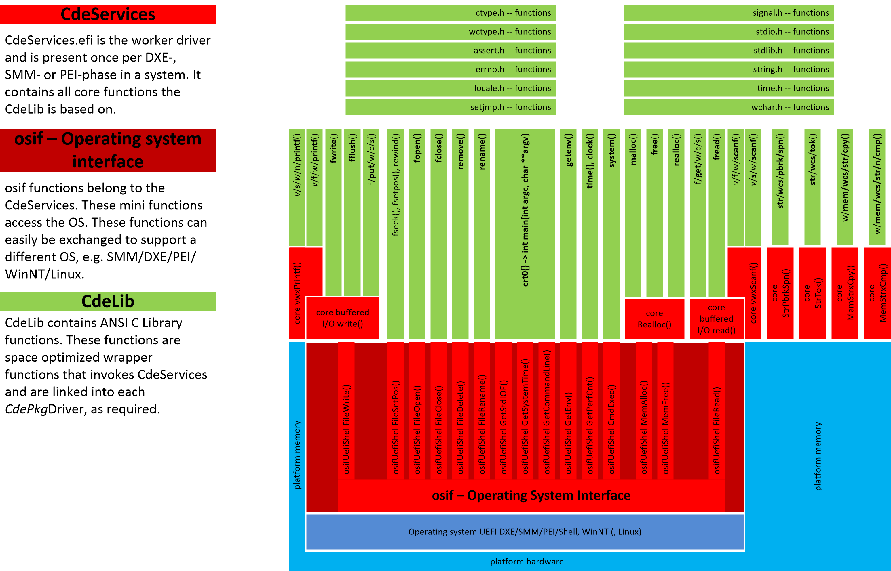
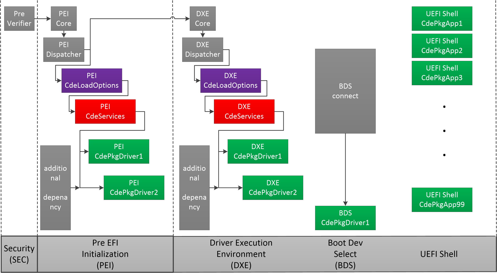

# CdePkg
* [Preface](https://github.com/MinnowWare/CdePkg#preface)
* [Introduction](https://github.com/MinnowWare/CdePkg#introduction)
* [Intention](https://github.com/MinnowWare/CdePkg#intention)
* [Implementation](https://github.com/MinnowWare/CdePkg#implementation)
	* [Interface architecture](https://github.com/MinnowWare/CdePkg#interface-architecture)
	* [CdeLoadOptions/command line](https://github.com/MinnowWare/CdePkg#cdeloadoptions--command-line)
	* [Boot flow architecture](https://github.com/MinnowWare/CdePkg#boot-flow-architecture)
* [Status](https://github.com/MinnowWare/CdePkg#status)
	* [todo](https://github.com/MinnowWare/CdePkg#todo)
* [Revision history](https://github.com/MinnowWare/CdePkg#revision-history)

C Development Environment Package for EDK2
## Preface
The programming language C is standartized by American National Standards Institute (ANSI) and
International Organization for Standardization (ISO) first in 1989 and 1990.
This is latest publicly available version of the [C99](http://www.open-std.org/JTC1/SC22/WG14/www/docs/n1256.pdf) standard.
The original [ANSI C](https://www.pdf-archive.com/2014/10/02/ansi-iso-9899-1990-1/ansi-iso-9899-1990-1.pdf), also known as C89 or
C90 is not officially available anymore.

Both, the *language* (operators, expressions, declarations, specifiers, e.g. `if`, `while`,
`+`, `&&`, `unsigned`, `char`, `struct` ...) and the *library* (functions, parameters, structures, macros, 
e.g. `NDEBUG`, `raise()`, `scanf()`, `struct lconv`, `errno` ...) are specified in this document (chapter 6 and 7)
and are obligatory for an implementation that claims to meet the standard.

In a particular C compiler / C library implementation both are completely coordinated to 
each other.

The Microsoft C/C++ compiler and it's library LIBCMT.lib as an implementation of this standard.
It is primarily designed to create C/C++ programs and drivers for the Windows Operating System. 
It is surely the most frequently used C compiler at all and continuesly enhanced, updated and
maintained by Microsoft.

This compiler is not a stand alone executable that simply translate C/C++ sourcecode to object 
modules. It is closely entwined with different build environments (WDK/DDK, SDK) consisting of libraries,
headerfiles, the operating system interface and platforms (x86-64/32, ARM64/32) to meet required code safety, code optimization 
(size vs. speed in different shades ) and maintainability (e.g. for debug and trace purpose).

The code generation and optimization aspects are not completely documented by Microsoft.
But the Microsoft compiler tends to produce machine code, that relies on the presence of
C library specified functions for storage space initialization, comparision and duplication 
(`memset()`,`strcpy()`, `strcmp()`). Additionally some still undocumented function calls
are produced by  the x86-32 code generator, when dealing with 64 bit integer types (`long long`),
that came into the C language standard in 1999.

## Introduction
**CdePkg**, C Development Environment Package, introduces the use of *Hosted Environment*,
as specified by ANSI C,
for both UEFI POST and SHELL drivers.
This is a reference implementation only, using the Microsoft C compiler, linker, library 
manager and IDE that comes with Visual Studio 2019 for x86 platforms.

A *Hosted Environment* for command line applications is standard, its introduction for drivers is a novum. This also applies for the UEFI environment. But the wealth of computing power of current UEFI machines offers the chance to translate ANSI C
compatible sourcecode to run as a UEFI POST driver.

With the growing complexity of firmware due to the requirements for both security and trust and the
need for speed in development, use of platform independent sourcecode allows:
* reuse of validated C sourcecode (from different origins, e.g. the open source community)[1](https://github.com/MinnowWare/CdePkg/blob/master/footnotes/footnote-1.md)
* crossdevelopment of complex firmware code on non-UEFI platforms with superb build and debug capabilities
* use static code analysis tools[2](https://github.com/MinnowWare/CdePkg/blob/master/footnotes/footnote-2.md)
* allow appraisal of the source code quality by human professionals[3](https://github.com/MinnowWare/CdePkg/blob/master/footnotes/footnote-3.md)

Since the UEFI "OS" interface (DXE/SHELL/SMM and PEI) can be accessed directly by the compiler
translated sourcecode and UEFI provides an independent set of functions, macros and type definitions,
ANSI C and UEFI "OS" specific sourcecode can  coexist seamlessly. 
This allows a functional ANSI C prototype to adjust successively 
to real world driver requirements in the UEFI environment. A UEFI SHELL application might be an intermediate step for this process if the target is a DXE or SMM driver.

In case, external UEFI libraries (created by the EDK build process) are not used in a particular UEFI
driver (and therefore the *Library Constructor* process is not needed), a UEFI driver can be translated
in the VS2019 build environment, which is much faster than the EDK build process (the driver's binary is not
placed in the BIOS image, of course).

*But the creation of syntactically correct sourcecode, using the
luxurious auto completion and mouse hover actions also for UEFI specific type definitions, enhances the
development process notably.*

## Intention
**CdePkg** is a feasibility study on how to provide a complete *Hosted Environment* 
(according to ANSI C Specification chapter 5.1.2) including all instrisic functions, 
which the compiler requires to be a **full featured C-compiler**, in particular the full
set of C-language operators (specifically `/`, `%`, `<<`, `>>` for 64 bit integers) for the 32 bit code generator, needed in PEI.

Furthermore the questions has to be answered, if UEFI based products can be improved regarding
* software quality (in terms of number of required updates during a life cycle)
* development time
* feature set (complexity and quantity)
* storage space needed in a flash part (the smaller the better)

if a standardized programming interface as ANSI C is available, in conjunction with a storage space optimization
strategy, as described below, that splits *wrapper libraries* from *worker drivers*.

In the UEFI programming environment not even the smallest piece of code can be cross developed on a
different platform, since function names differ in upper/lower case letters, format specifier for
`Print()`-functions differ from C's `printf()`, a `scanf()` counterpart is absent, wideness
of stringtypes differs from corresponding ANSI C functions.

Since in many cases the ANSI C specification allows freedom for a particular library implementation 
(return values, flags, structure layout) but the chosen build and debug environment is VS2019 the original
Microsoft C Library functions had to be recreated, fully compatible, bug for bug (except otherwise noted). 
This would provide the most relieable solution for cross development, enable the use of the original
Microsoft header files and prevent from documenting yet another C Library implementation.

A *Hosted Environment* provides the following obligatory features: 
* [`int main(int argc,char **argv)`](https://docs.microsoft.com/en-us/cpp/c-language/main-function-and-program-execution?view=vs-2019) is the driver entry point[4](https://github.com/MinnowWare/CdePkg/blob/master/footnotes/footnote-4.md)
* `argc` and `argv` are used for parameter passing, in **CdePkg** also for POST drivers https://docs.microsoft.com/en-us/cpp/c-language/parsing-c-command-line-arguments?view=vs-2019
* full blown ANSI C library
* buffered I/O, that means that [`ungetc()`](https://docs.microsoft.com/en-us/cpp/c-runtime-library/reference/ungetc-ungetwc?view=vs-2019) works on streams, beside an improvement in speed
* [`exit()`](https://docs.microsoft.com/en-us/cpp/c-runtime-library/reference/exit-exit-exit?view=vs-2019) invocation on driver termination, that implies
    * run [`atexit()`](https://docs.microsoft.com/en-us/cpp/c-runtime-library/reference/atexit?view=vs-2019)-registered functions
    * free allocated memory 
    * remove all tempfiles (not applicable for POST drivers)
    * close open files (not applicable for POST drivers)

The command line parameter / load options for each *CdePkg*Driver shall be able to be adjusted
on a final system without recompiling the BIOS and updating the BIOS chip.
This e.g. allows the support engineer to change BIOS behaviour on a (partially)
defect system for repair/debug mode, enabling trace messages, excluding special
(non-compliant) devices from beeing enumerated. 

## Implementation
**CdePkg**'s functionality is composed of three components:
  1. the C Library **CdeLib**
  2. the service driver **CdeServices**
  3. the POST command line reference implementation [**CdeLoadOptions**](https://github.com/MinnowWare/CdePkg/tree/master/CdeLoadOptionsDxe)

all in 32 and 64 bit variants for DXE, SMM and PEI each.

**CdeLib** and **CdeServices** are highly optimized for space minimized appearance of 
ANSI C library functions in the UEFI drivers. This is achieved by implementing all-embracing worker functions

* `printf()`-family core
* `scanf()`-family core
* `realloc()` core (`malloc()`, `free()`, `realloc()` and `calloc()`)
* `strcmp()`-family core (all `str`/`wcs`/`mem` `n` `i` functions)
* `strcpy()`-family core (all `str`/`wcs`/`mem` `n` functions)
* `strpbrk()`/`strspn()` -family core (all `str`/`wcs` `pbrk`- and `spn`- functions)
* `strtok()`-family core (all `str`/`wcs` `tok`-functions)
* CRT0 startup code for DXE, SMM, PEI
* buffered I/O core (`fread()`, `fwrite()` and `ungetc()`)
* locale character tables
* interface functions to access DXE- and PEI-API

in the **CdeServices** driver, that resides once in DXE-, SMM- and PEI-phase each.
The **CdeLib** just provides small wrapper functions that invoke **CdeServices**.

### Interface architecture

### **CdeLoadOptions** / command line
Each *CdePkg*Driver reports its EfiCallerIdGuid while running through CRT0 to **CdeLoadOptions**.
**CdeLoadOptions** provides a pointer to the matching "Command Line" from an simple EfiCallerIdGuid/CommandLine table
within the file [`CdeLoadOptions.h`](https://github.com/MinnowWare/CdePkg/blob/master/Include/CdeLoadOptions.h), 
compiled into the [**CdeLoadOptions**](https://github.com/MinnowWare/CdePkg/blob/master/CdeLoadOptionsDxe/CdeLoadOptionsDxe.c) driver binary.

**This is just a proof of concept. In a real implementation, as mentioned above, the command line can be
changed without recompilation and BIOS update.**

### Boot flow architecture
According to that explainations the boot flow is formt as:
1. PEI CdeLoadOption (to provide the commandline to PEI drivers)
2. PEI CdeServices (to provide the space optimized worker functions)
3. PEI custom drivers (CdeServicesPei-based)
4. DXE CdeLoadOption (to provide the commandline to DXE drivers)
5. DXE CdeServices (to provide the space optimized worker functions)
6. DXE custom drivers (CdeServicesDxe-based)
7. BDS custom drivers
8. UEFI Shell drivers (CdeServicesDxe-based, yet still Torito-C-Library-based)

## Status
The **CdeLib** and **CdeServices** are derived from their companion project 
[Torito C Library](https://github.com/JoaquinConoBolillo/torito-C-Library) but
split into *wrapper*/*worker* architecture. (Internally [Torito C Library](https://github.com/JoaquinConoBolillo/torito-C-Library)
was designed from the very beginning for that splitted architecture, but merged library and driver into one executable, to
run on platforms without **CdeServices** protocol.)

The functions below are already implemented and tested, every single one of them, except otherwise noted:

[List of available functions](https://github.com/MinnowWare/CdePkg/blob/master/implemented.md)

[Torito C Library](https://github.com/JoaquinConoBolillo/torito-C-Library#torito-c-library) has passed extensive
tests to verify Microsoft's C Library compatibility and is also approved in various real world applications.
Therefore the **CdePkg**'s C library will be validated by simple tests only, in the [**CdeValidationPkg**](https://github.com/MinnowWare/CdeValidationPkg#cdevalidationpkg), for
DXE, SMM and PEI each.

### todo
* add SMM support
* 20190714 <del>add PEI support</del>
* move CRT0 startup code to **CdeServices**
* move local character tables to **CdeServices**
* move buffered I/O core to **CdeServices**
* validate functions in DXE, SMM and PEI [List of available functions](https://github.com/MinnowWare/CdePkg/blob/master/implemented.md)
* complete library implementation

[todo reminder](todoreminder.md)

# Revision history

### 20190824
* Merge branch 'CdeValPkg'

### 20190811\Branch CdeValPkg
* update `CdeLib.lib` and `CdeServicesXXXyy.efi` to 20190811/3adeb812a0fafb63f61bc4b3a41fc52bb1b70938
  (unification of CDEMOFINE for all platforms, use gEfiCallerBaseName on all platforms for module name)
* add validation driver/executables for all `ctype.h`- and `wctype.h`-related functions:
    (ctypeALLPei, ctypeALLDxe, wctypeALLPei, wctypeALLDxe)
* remove previously used single function test drivers

### 20190730\Branch CdeValPkg
* add all *CTYPE.H()*-functions to PEI post phase

###	20190728\Branch CdeValPkg
* add all *CTYPE.H*-functions for DXE

###	20190727\Branch CdeValPkg
* add command line fir <em>clockPei</em>
* add carrage return to CdeWelcomeDxe and -Pei

###	20190726\Branch CdeValPkg
* initial version of branch CdeValPkg
* add MFNBAR as bare/nacked parameter for CDEMOFINE macro
* add clockDxe commandline to CdeLoadOptions.h
* update CdeSrcPkg/b81394c620206ebbc300216652cd43d7f4ac94e3

### 20190706
* add initial PEI Support, rudimentary functional range: CdeSrcPkg/0ea26421a591adcb4443e46913da2f429d7f312f

### 20190605
* update CdeSrcPkg/e32a2359acc2c5916581207d5627c1f73a5d1ba6
